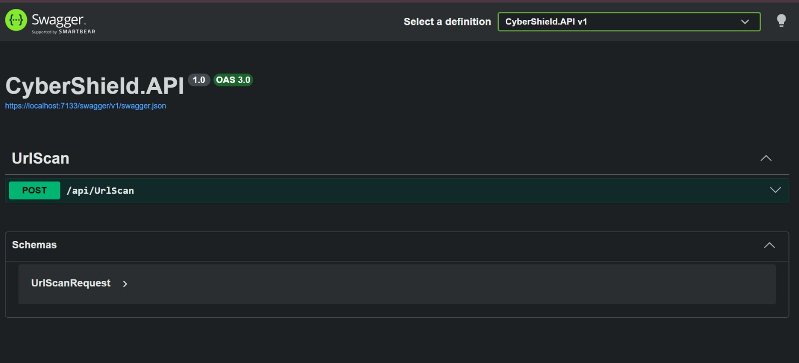

# 🛡️ CyberShield

CyberShield is a web-based cybersecurity application that scans URLs for potential phishing and malicious threats using rule-based detection and the VirusTotal API.

## Features

- 🔍 URL scanning
- 🦠 VirusTotal API integration
- 📊 Risk score calculation
- 💾 Scan history stored in MySQL
- 📖 Swagger API documentation

## Technologies Used

- ASP.NET Core Web API
- C#
- MySQL
- Entity Framework Core
- Swagger (Swashbuckle)
- VirusTotal API

## Project Structure

```
CyberShield.API
│
├── Controllers
├── Services
├── Models
├── DTOs
├── Interfaces
├── Data
└── Program.cs
```

## How to Run

1. Clone the repository.
2. Configure the MySQL connection string in `appsettings.json`.
3. Add your VirusTotal API key.
4. Run:

```bash
dotnet ef database update
dotnet run
```

5. Open:

```
https://localhost:7133/swagger
```
## API Documentation



## Future Improvements

- JWT Authentication
- Angular Frontend
- User Dashboard
- Scan History
- WHOIS Lookup
- SSL Certificate Checker
- AI-based Threat Analysis

## Author

Krithika
